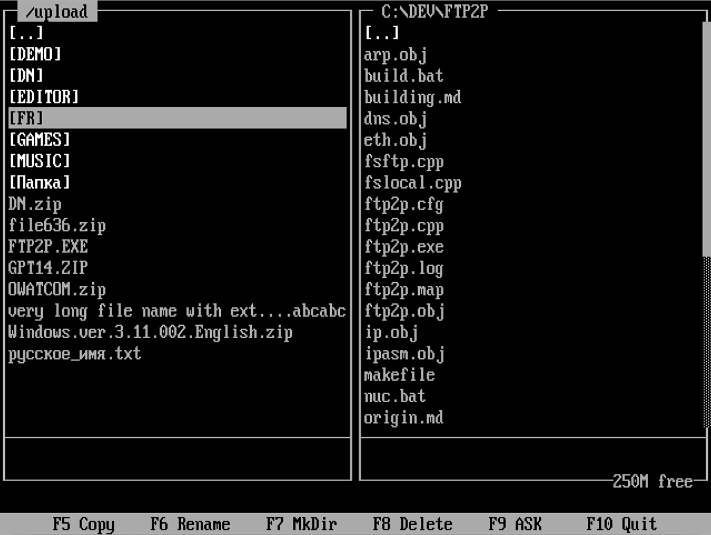

# FTP2P

FTP2P is a dual-pane FTP client for MS-DOS built with Open Watcom 1.9.

It is developed as a separate utility on top of an mTCP-based source tree. The repository includes the source code required to build FTP2P, while release binaries are provided only for FTP2P itself.

## Background

Working with real DOS machines on modern networks is often inconvenient.  
While TCP/IP stacks such as mTCP provide the necessary networking
functionality, there is still a noticeable lack of practical FTP clients
for DOS.

In practice this makes file exchange between DOS systems and modern
computers unnecessarily complicated. Users often end up relying on
command-line tools or indirect methods of transferring files.

At the same time, the DOS ecosystem already has excellent two-panel file
managers, and new ones continue to appear. However, a convenient
two-panel FTP client similar to classic file managers has been largely
missing.

FTP2P was created to address this gap. The goal of the project is to
provide a simple and convenient dual-pane FTP client for DOS systems,
making it easier to browse local and remote directories and transfer
files between them.

## Repository layout

- `ftp2p/` - FTP2P application sources
- `mtcp/` - required mTCP-based source tree used for build and runtime integration

FTP2P is not a fully standalone project. It depends on code and tools from mTCP, and the repository is structured to keep the build reproducible.

## Features

- dual-pane fullscreen DOS interface
- remote FTP and local DOS panels
- directory navigation on both sides
- file copy in both directions
- rename, delete, and create-directory operations
- switchable overwrite policy
- UTF-8 filename handling with DOS-compatible local name generation
- Open Watcom 1.9 oriented codebase

## Status

Usable, but still under active cleanup and bug fixing.

## Build

FTP2P targets MS-DOS and Open Watcom 1.9.

The project is built against the included mTCP source tree. Some runtime functionality also depends on tools from the same environment.

See `BUILDING.md` for build notes.

## Releases

GitHub releases contain FTP2P binaries only.

The corresponding source code for each release is available in this repository at the matching tag, including the FTP2P sources and the required mTCP-based source tree used to build the released binary.

## Origin

FTP2P is based in part on the original mTCP FTP client by Michael B. Brutman.

This repository is not an official mTCP mirror. It is a separate project repository that includes the source tree required to build FTP2P and documents its origin in `ORIGIN.md`.

## License

This project is distributed under the GNU General Public License v3.0.

Because FTP2P is based in part on mTCP code, the repository follows the same licensing model. See `LICENSE` for details.